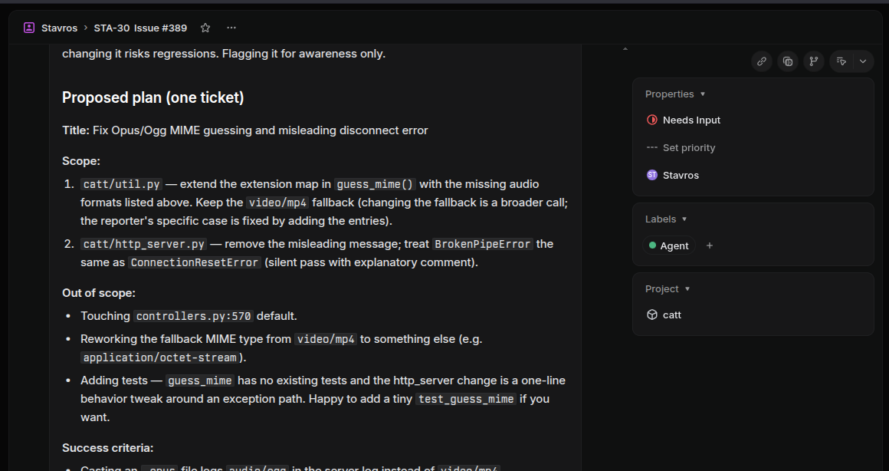

# Symphony

Symphony turns Linear or GitHub Projects into the front end for a fleet of
AI coding agents. Label a ticket (or toggle a project field), walk away,
and read the agent's reply when you have a moment; when you reply, the agent
picks the thread back up. It runs as a single daemon on your own machine,
clones each ticket's repo into its own sandbox, hands the work to
[OpenCode](https://opencode.ai/), and posts the result back as a comment.
Several tickets can be in flight at once, so you can keep planning while the
agents type.

The daemon is small, self-hosted, and has no UI of its own. Your issue
tracker is the UI.

## Screenshots

<p>
  
  
</p>

## Quickstart

You need Python 3.11+, `git`, `bwrap` (bubblewrap), and OpenCode installed and
authenticated. Then:

```bash
# 1. Install
uvx symphony-linear --help

# 2. Create a workspace directory and a minimal config inside it
mkdir ~/symphony && cd ~/symphony
# For Linear:
cat > config.yaml <<'YAML'
linear:
  api_key: ${LINEAR_API_KEY}
  bot_user_email: you+symphony@example.com
YAML
# Or for GitHub Projects v2 (everything else has sensible defaults):
cat > config.yaml <<'YAML'
github:
  token: ${GITHUB_TOKEN}
  project: users/your-username/projects/1
YAML

# 3. Provide the bot's API key and run
export LINEAR_API_KEY=lin_api_...   # or GITHUB_TOKEN=ghp_...
uvx symphony-linear
```

That gets you a running daemon. To actually trigger work you still need to
set up your tracker: see [Linear setup](#linear-setup) or
[GitHub setup](#github-setup).

## Installation

Symphony is published on PyPI as `symphony-linear`, and that is also the
name of the command it installs.

### With uvx (recommended)

`uvx` runs Symphony in a managed virtual environment without touching your
system Python:

```bash
uvx symphony-linear --help
```

This is convenient for casual use and for `--validate-config`. For a
long-running daemon you may prefer to install it once rather than have
`uvx` resolve the environment on every start:

```bash
uv tool install symphony-linear
symphony-linear --help
```

### With pip

If you don't have `uv`, plain `pip` works:

```bash
pip install symphony-linear
symphony-linear --help
```

Use `pipx` or a virtualenv if you'd rather not install into your system
Python.

### From source

```bash
git clone https://github.com/skorokithakis/symphony.git
cd symphony
uv sync
.venv/bin/symphony-linear --help
```

### Runtime dependencies

These are not Python packages and won't be installed for you:

- **bwrap** (bubblewrap): `apt install bubblewrap`, `dnf install bubblewrap`,
  or `pacman -S bubblewrap`.
- **git**, configured well enough to clone the repos you want the agent to
  work on.
- **OpenCode**, installed and authenticated. The daemon invokes `opencode`
  inside the sandbox; whatever is on the daemon's `$PATH` is visible to the
  agent. Set `SYMPHONY_SANDBOX_PATH` if the daemon runs with a stripped
  `$PATH`, for example under `systemd`.

## Linear setup

This is the one-off plumbing that connects Symphony to your Linear workspace.
You do it once per workspace, plus a small per-repo step for each project
you want the agent to touch.

### Create a bot user

Create a separate Linear user for the bot so its comments and state changes
are easy to spot. Gmail aliases work: `yourname+symphony@gmail.com`. Invite
the bot into your workspace.

### Generate a Personal API key

Sign into Linear as the bot. Open **Settings** → **API** → **Personal API
keys**, create a key, and keep it somewhere safe; this is the value you'll
supply as `LINEAR_API_KEY`.

### Add a "Needs Input" workflow state

In your team's workflow settings, add a state called **Needs Input**.
Symphony moves tickets here when it finishes a turn and is waiting for you
to reply. You can rename this state later; the name lives in `config.yaml`.

### Create the trigger label

Add a label called **Agent** to the team. Any ticket carrying this label
becomes eligible for the agent. The label name is configurable.

### Optional: a QA workflow state

If you'd like to manually exercise the agent's work, for instance by
clicking around a running web app, add a workflow state called **QA**, point
`linear.qa_state` at it in your config, and add a `.symphony/serve` script
to your repo. When you drop a ticket into that state the daemon runs your
serve script inside the sandbox. Details under [Manual QA](#manual-qa).

### Per-repo: attach a Repo link

For each repository you want Symphony to work on:

1. Create a Linear project. Any team project will do; Symphony only uses it
   to find the repo URL.
2. In that project, open **Resources** and add a link with the label `Repo`
   (case-insensitive) and the git clone URL as the target, for example
   `git@github.com:you/your-project.git`.

That link is how the daemon discovers which repo belongs to which ticket.

## GitHub setup

This is the one-off plumbing to connect Symphony to a GitHub project. You do
it once per project. The daemon uses the GitHub Projects v2 (beta) API; the
older Projects v1 is not supported.

### Create a bot account

Create a separate GitHub user for the bot so its comments and state changes
are easy to spot. Add the bot as a collaborator (with at least read access)
to every repository the bot should clone.

### Generate a token

The bot needs read/write access to Issues, Projects, and read access to
repository Contents:

- **Classic personal access token.** Enable the `repo` and `project`
  scopes.
- **Fine-grained personal access token.** Grant read/write on Issues,
  read/write on Projects, and read on Contents for the repositories.
- **GitHub App** with equivalent permissions.

Supply the token as `GITHUB_TOKEN` in the environment, or put it directly
under `github.token` in your config. When the config field is empty or
absent the daemon falls back to the `GITHUB_TOKEN` environment variable.

### Create a project

Create a GitHub Projects v2 project on your user or organization account.
Note its reference in the format `orgs/<org>/projects/<number>` or
`users/<user>/projects/<number>`. That string goes into `github.project`
in your config — for example:

```yaml
github:
  project: users/my-username/projects/1
  # or: orgs/my-org/projects/1
```

### Configure Status

Every GitHub project starts with a built-in single-select field called
`Status`. The daemon expects this field to exist (it does by default on
every new project) and will auto-create any missing options on it at
startup — just set the option names you want in `github.in_progress_status`,
`github.needs_input_status`, and optionally `github.qa_status`, and the
daemon handles the rest.

If your project uses a custom Status field with a different name, set
`github.status_field` to that name.

### The Symphony trigger field

On startup the daemon auto-creates a single-select field called `Symphony`
on the project (configurable via `github.trigger_field`). It comes with
one option, `on`.

- To **trigger** an issue: set its `Symphony` field to `on`. The daemon
  picks it up on the next poll and starts working.
- To **untick** an issue: set the field to empty, or remove the item from
  the project entirely.

Untriggering or moving the issue out of an active Status causes Symphony
to cancel any in-flight subprocesses, delete the workspace, and remove
the issue from its internal state on the next poll tick — just like
removing the trigger label on Linear.

### Multi-repo projects

GitHub Projects v2 can contain items from any repository that the project
references. Each issue remembers its own repository; Symphony clones from
that repo's SSH URL. There is no per-project "Repo" link to configure.

### Identifier convention

Symphony uses `<owner>-<repo>-<number>` as the identifier for GitHub
issues — for example `my-org-my-repo-42`. This appears in workspace
directory names and metadata comments, and is used to derive the branch
name when `auto_branch` is enabled.

## Configuration

Symphony reads `config.yaml` from its workspace directory, which defaults to
the current working directory and can be overridden with `--workspace`. The
daemon refuses to start without a valid config; validate it any time with
`symphony-linear --validate-config`.

### Minimal config

For Linear:

```yaml
linear:
  api_key: ${LINEAR_API_KEY}
  bot_user_email: yourname+symphony@gmail.com
```

For GitHub:

```yaml
github:
  token: ${GITHUB_TOKEN}
  project: users/your-username/projects/1
  # Optional: enable manual QA by uncommenting.
  # qa_status: QA
```

You can omit the credential entirely and let the daemon read the
appropriate environment variable (`LINEAR_API_KEY` or `GITHUB_TOKEN`)
directly; that is often nicer for systemd or secret managers.

### Full annotated config

The annotated config below shows the Linear backend. For the GitHub
version see `config.yaml.example` in the repo root — both blocks are
documented there side by side.

```yaml
# config.yaml (placed in the workspace directory)

# Choose exactly one backend — linear or github.
linear:
  # REQUIRED. Linear Personal API key from the bot account.
  # Use ${LINEAR_API_KEY} to read from the environment, or omit this field
  # entirely and the daemon will fall back to the LINEAR_API_KEY env var.
  api_key: ${LINEAR_API_KEY}

  # REQUIRED. Email address of the bot user in Linear.
  bot_user_email: yourname+symphony@gmail.com

  # Name of the label that triggers the bot (default: Agent).
  trigger_label: Agent

  # Workflow state set while the AI is working (default: In Progress).
  in_progress_state: In Progress

  # Workflow state set while waiting for human reply (default: Needs Input).
  needs_input_state: Needs Input

  # Optional. Workflow state that enables manual QA. When a ticket enters
  # this state the daemon runs the repo's .symphony/serve script inside the
  # sandbox. Only one serve runs globally; the newest entrant wins. Omit to
  # disable the feature entirely.
  # qa_state: QA

sandbox:
  # Paths to conceal from the agent inside the sandbox. Directories become
  # an empty tmpfs; files and sockets are replaced with /dev/null. ~ and
  # symlinks are expanded.
  hide_paths:
    - ~/.ssh
    - ~/.gnupg
    - ~/.aws
    - ~/.config/gcloud
    - ~/.netrc
    - ~/.docker
    - /run/docker.sock

  # Optional. Extra host paths bound read-write into the sandbox.
  # Missing paths cause a fatal error. Applied before hide_paths, so hiding
  # still wins in case of collision.
  # WARNING: these bypass the read-only host root mount.
  # extra_rw_paths:
  #   - ~/projects/shared-tools

# Seconds between poll cycles (default: 30, minimum: 1).
poll_interval_seconds: 30

# Max seconds per AI turn before the process is killed (default: 1800).
turn_timeout_seconds: 1800
```

A copy of this example lives at `config.yaml.example` in the repo root.

### Webhook (optional)

A webhook receiver cuts poll latency from up to `poll_interval_seconds` to
~1 second; polling continues as a safety net. The feature is opt-in — omit the
`webhook:` block to stay on polling only.

```yaml
webhook:
  port: 8080
  linear_secret: ${WEBHOOK_SECRET}
```

`linear_secret` is the HMAC-SHA256 signing secret. If the field is absent or
empty the daemon falls back to the `SYMPHONY_LINEAR_WEBHOOK_SECRET` environment
variable.

In Linear's UI: **Settings** → **API** → **Webhooks** → **Create webhook**.
Set the URL to `http://<your-host>:<port>/webhooks/linear/`, paste the same
signing secret, and subscribe to **Issue** and **Comment** events.

Symphony does not do TLS. Terminate TLS upstream (nginx, Caddy, Cloudflare)
if exposing the port publicly. Linear can deliver to either plain HTTP or
HTTPS, but production deployments should use HTTPS.

## Running

```bash
symphony-linear
```

Symphony runs in the foreground and logs to stderr. For interactive use it
is fine to start it in `tmux` or `screen`; for anything more permanent a
`systemd --user` unit is the obvious home.

A starting point for `~/.config/systemd/user/symphony.service`:

```ini
[Unit]
Description=Symphony Linear daemon
After=network-online.target

[Service]
Type=simple
WorkingDirectory=%h/symphony
# Set the env var that matches your backend. Use exactly one of these two
# Environment= lines (systemd does not support trailing `#` comments on
# Environment= values — the `#` and everything after it become part of the
# value).
Environment=LINEAR_API_KEY=lin_api_...
# Environment=GITHUB_TOKEN=ghp_...
# systemd strips PATH; tell the sandbox where to find opencode, git, bwrap.
Environment=SYMPHONY_SANDBOX_PATH=/usr/local/bin:/usr/bin:/bin
ExecStart=%h/.local/bin/symphony-linear
Restart=on-failure

[Install]
WantedBy=default.target
```

Then `systemctl --user daemon-reload && systemctl --user enable --now symphony`.

### Flags

| Flag                 | Effect                                                              |
|----------------------|---------------------------------------------------------------------|
| `--debug`            | Enable DEBUG-level logging.                                         |
| `--workspace <path>` | Override workspace directory (default: current working directory).  |
| `--validate-config`  | Load and validate the config, then exit.                            |

### Startup behaviour

On launch the daemon recovers any orphan tickets it was working on when it
last stopped. It posts a recovery comment and parks the ticket in the
needs-input state so you can decide whether to retry. State is persisted at
`<workspace>/state.json` and rewritten atomically.

### Graceful shutdown

`SIGINT` (Ctrl+C) or `SIGTERM` triggers a clean shutdown: in-flight
subprocesses are killed, state is persisted, and the daemon exits.

## How it works

Every `poll_interval_seconds`, Symphony queries the tracker (Linear or
GitHub) for tickets that carry the trigger signal and live in one of the
active workflow states. New tickets enter the **initial pipeline**:

1. Find the project's `Repo` link to discover the git URL.
2. Clone or update the repo into `<workspace>/<sanitised-identifier>`.
3. Switch to the ticket's branch, creating one if needed. If
   `auto_branch: false` is set, the workspace stays on whatever `git clone`
   produced (typically the remote default branch).
4. Run `.symphony/setup` inside the sandbox, if your repo has one.
5. Launch `opencode run` inside the sandbox with the ticket's title and
   description as the prompt.
6. Post the agent's final message as a comment, plus a small metadata
   comment with the workspace path and OpenCode session id.
7. Transition the ticket to the configured needs-input state.

Tickets you've already replied to enter the **resume pipeline** instead:
the daemon picks up the new human comments, runs `opencode run --session
<id>`, and posts the result.

Up to five turns run in parallel across different tickets, with per-ticket
serialisation so a single ticket never has two turns in flight. The agent
and you only ever communicate through tracker comments; the daemon has no
other channel.

### Sandbox

Each OpenCode turn runs inside a bubblewrap sandbox. The ticket's workspace
is mounted read-write; the rest of the host root is read-only. Credential
directories such as `~/.ssh`, `~/.gnupg`, `~/.aws`, the Docker socket and a
handful of others are concealed by overlaying empty tmpfs or `/dev/null`.
The network namespace is shared so the agent can reach the internet, but
user, PID, IPC and UTS namespaces are isolated. Environment is wiped down
to `HOME` plus an inherited `PATH` (or `SYMPHONY_SANDBOX_PATH` if set).

Git operations run outside the sandbox using the daemon's own credentials,
so cloning private repositories works without exposing your keys to the
agent. The flip side is that the agent itself cannot `git push`; you do
that yourself, after reviewing.

## Manual QA

If you set `linear.qa_state` (or `github.qa_status`) and add an executable
`.symphony/serve` script to your repo, moving a ticket into that workflow
state launches the script inside the sandbox. Use it to run a dev server, a
worker, or anything else you want to exercise by hand.

Only one serve runs across the whole daemon. Dropping a second ticket into
QA bumps the first back to the needs-input state and starts the new one.
Commenting on a ticket that is currently in QA pulls it back out into the
in-progress state: on the next poll tick the serve is killed, the agent
runs another turn on your comment, and the ticket lands in the needs-input
state. Move it back to QA to test again.

The script is given no time limit and the daemon does not interpret its
output. If it exits non-zero within ten seconds, or exits later for any
reason, the daemon posts a comment containing the exit code and a thousand
characters of stdout/stderr, and the ticket goes back to the needs-input
state. Clean exits within ten seconds are treated as a parent that has
daemonised a child, and are silent.

## Repo conventions

Three optional files in a repo change how Symphony treats it. All three
live under `.symphony/` at the repo root.

### `.symphony/setup`

An executable script run inside the sandbox once, right after each fresh
clone, before the agent starts. Use it to install dependencies, prepare
caches, or whatever else the project needs. Non-zero exit aborts the ticket
with an error comment. The script has a five-minute timeout.

### `.symphony/serve`

An executable script run inside the sandbox when the ticket enters the
configured `qa_state`. See [Manual QA](#manual-qa) for the details.

### `.symphony/config.yaml`

Optional per-project overrides for a small set of global settings.
Currently supported keys:

| Key                    | Type      | Default            | Notes                                          |
|------------------------|-----------|--------------------|------------------------------------------------|
| `auto_branch`          | bool      | inherits global    | Applied on first clone, not on resume.         |
| `turn_timeout_seconds` | int (> 0) | inherits global    | Re-read on every turn (initial and resume).    |

```yaml
# .symphony/config.yaml (committed in your project repo)
auto_branch: false
turn_timeout_seconds: 600
```

Unknown keys, invalid YAML or out-of-range values cause Symphony to post an
error comment on the ticket and block the run until you fix the file and
comment to retry. Per-project values win over the global config; missing
keys fall back to the global value.

## Troubleshooting

### Find the workspace and session id

For every ticket it processes, Symphony posts a small metadata comment in
this shape:

```
**Symphony**
- workspace: `<workspace>/TEAM-42`
- session: `ses_abc123`
```

The workspace path is where the repo was cloned (Linear tickets use the
team key + number like `TEAM-42`; GitHub issues use
`<owner>-<repo>-<number>`). The session id is the OpenCode session you can
resume manually.

### Resume a session by hand

```bash
cd <workspace>/TEAM-42
opencode run --session ses_abc123 -- "Hello, what's the status?"
```

OpenCode session state lives under `~/.opencode/` and
`~/.local/share/opencode/`. These are bind-mounted into the sandbox so
session resumes work both from inside the daemon and from your shell.

### Check daemon state

```bash
cat <workspace>/state.json | python -m json.tool
```

This shows every tracked ticket, its status, workspace path, branch, and
session id.

## Limitations

- **No `git push` from inside the agent.** The sandbox conceals
  credentials, so the agent cannot push. Pushing is a deliberate human
  step.
- **No mid-turn steering.** You cannot interrupt or redirect a turn while
  it is running. Comments you post mid-turn are queued and delivered at the
  start of the next one.
- **No auto-retry.** A failed turn moves the ticket to `failed` and stays
  there. Comment on the ticket to re-trigger.
- **Single workspace per ticket.** A ticket's workspace is reused across
  turns; the agent works in the same clone every time.
- **Trigger-only enrolment.** The trigger label (Linear) or trigger field
  (GitHub) is the only way to enrol a ticket. There is no manual nudge,
  slash command, or webhook.
- **No priority.** Tickets are picked in whatever order the tracker returns
  them. There is no queue.
- **One QA serve at a time.** A single `.symphony/serve` runs globally with
  no port allocation. Your script is responsible for binding to whichever
  port you (or your reverse proxy) expect.
- **Linear free plan caps.** Free Linear workspaces are capped at 10
  members and 250 issues; the bot counts against the member cap.

## Development

```bash
git clone https://github.com/skorokithakis/symphony.git
cd symphony
uv sync
.venv/bin/pytest                              # full suite
.venv/bin/pytest -m "not integration"         # unit only
```

Integration tests shell out to `bwrap` and `git` but never to the real
`opencode` binary or any LLM. See `AGENTS.md` for an orientation to the
codebase.

## License

MIT. See `LICENSE`.
